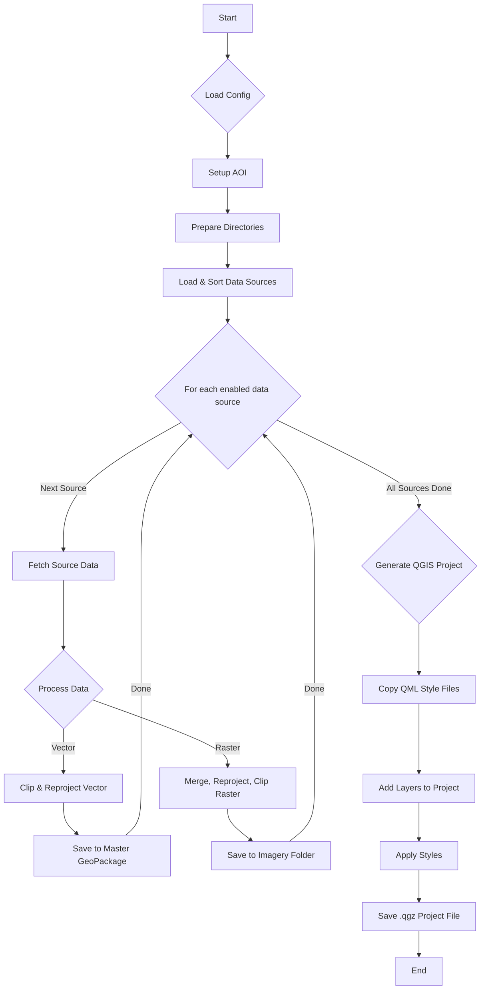

# SpatiaEngine V1

**SpatiaEngine** is a powerful, configuration-driven GIS data processing pipeline designed to automate the tedious and time-consuming tasks of geospatial data preparation. It streamlines the entire workflow, from data acquisition to final project delivery, allowing GIS professionals to focus on analysis rather than data wrangling.

The engine automatically fetches data from various sources (WFS services, local GeoPackages, online repositories), processes them for a specific Area of Interest (AOI), standardizes them to a consistent projection, and generates a ready-to-use, professionally styled QGIS project.

## Key Features

-   **Configuration-Driven**: Control the entire pipeline via a single, human-readable YAML file (`config/sources.yaml`).
-   **Multiple Data Source Types**: Natively supports WFS, local GeoPackages, indexed GeoPackages for large datasets, and remote raster files (like LiDAR and satellite imagery).
-   **Automated AOI Definition**: Define your Area of Interest simply by providing SNRC (National Topographic System of Canada) map sheet codes.
-   **Intelligent Coordinate Projection**: Automatically reprojects all data to the appropriate MTM (Modified Transverse Mercator) zone for Quebec, or allows for a user-defined Coordinate Reference System (CRS).
-   **Advanced Vector Processing**: Clips vector data precisely to the AOI boundary, ensuring clean and accurate datasets.
-   **Robust Raster Processing**: Efficiently merges, clips, and reprojects large raster datasets, and automatically generates hillshades for elevation models.
-   **Automated QGIS Project Generation**: Creates a styled `.qgz` QGIS project with all processed layers, organized and ready for immediate analysis. Layer styles are automatically applied based on predefined QML files.
-   **Extensible by Design**: The factory pattern architecture allows for the easy addition of new, custom data source types to fit any project need.

---

## How It Works: The Pipeline Architecture

SpatiaEngine follows a clear, sequential process orchestrated by the `PipelineManager`. The workflow is designed to be robust and transparent, providing detailed logs at every step.



---

## Project Structure

The project is organized into a modular structure to separate concerns and facilitate maintenance and development.

```
./
├── core/                 # Core application logic
│   ├── aoi/              # Area of Interest definition and handling
│   ├── config/           # Configuration management and validation
│   ├── datasources/      # Logic for different data source types (WFS, GPKG, etc.)
│   ├── pipeline/         # Main pipeline orchestration
│   ├── processing/       # Vector and raster processing functions
│   └── qgis/             # QGIS project generation and styling
├── config/
│   └── sources.yaml    # Main user-facing configuration file
├── tests/                # Unit and integration tests
├── output_data/          # Default directory for all generated output
├── cache/                # Caches for downloaded data (e.g., MNT tiles)
├── logs/                 # Log files for pipeline runs
├── main.py               # Main CLI entry point for the application
├── Makefile              # Shortcuts for common commands (e.g., running the pipeline)
├── env_clone.yml         # Conda environment file for reproducibility
└── README.md             # This file
```

---

## Installation and Setup

This project uses Conda to manage its complex geospatial dependencies, including GDAL and the QGIS API.

1.  **Prerequisites**: Ensure you have Miniconda or Anaconda installed on your system.

2.  **Create the Conda Environment**: Use the provided `env_clone.yml` file to create a new Conda environment with all the necessary packages at their correct versions.

    ```bash
    # Create the environment from the file
    conda env create -f env_clone.yml

    # Activate the new environment
    conda activate spatiaengine-stable
    ```

---

## Environment Configuration

To ensure the application is portable and secure, SpatiaEngine uses environment variables to locate critical resources. **These variables must be configured in your shell environment before running the application.**

1.  **`QGIS_PREFIX_PATH` (Mandatory)**

    This variable must point to the root of your Conda environment where the QGIS libraries are installed.

    -   **How to find the path:**
        1.  Activate your conda environment: `conda activate spatiaengine-stable`
        2.  Run the command: `echo $CONDA_PREFIX`
    -   **How to set the variable:** Add the following line to your shell profile file (e.g., `~/.zshrc`, `~/.bash_profile`):
        ```bash
        export QGIS_PREFIX_PATH="/path/to/your/conda/envs/spatiaengine-stable"
        ```
        *(Replace the path with the output from the command above)*

2.  **`GIS_DB_PATH` (Mandatory)**

    This variable must point to the root directory of your reference GIS database. This folder should contain your source GeoPackages, rasters, and QML style files.

    -   **How to set the variable:** Add the following line to your shell profile file:
        ```bash
        export GIS_DB_PATH="/path/to/your/gis/database/root"
        ```
        *(Example: `export GIS_DB_PATH="/Users/Shared/CodeBase/References/GIS_DB"`)*

**Important:** You must restart your terminal or "source" your profile file (e.g., `source ~/.zshrc`) for these changes to take effect.

---

## Configuring the Pipeline

The entire pipeline is controlled by the `config/sources.yaml` file. This is where you define the specifics of your project and the data you want to process.

-   **`project_info`**: Basic metadata for your project, including a unique `id`.
-   **`aoi_config`**: Defines the Area of Interest. Currently supports `SNRC` type, where you provide a list of map sheet codes.
-   **`projection`**: Allows you to specify a `target_crs` for all output layers. If left blank, the application will automatically determine the appropriate MTM zone.
-   **`datasources`**: This is a list of all the data sources to be processed. Each source is an object with several key properties:
    -   `type`: The type of the data source (e.g., `local_gpkg`, `mnt_lidar_quebec`, `indexed_local_gpkg`).
    -   `enabled`: Set to `true` to process this source, `false` to skip it.
    -   `path`: The path to the data source. **Crucially, this path should use the `$GIS_DB_PATH` environment variable** (e.g., `$GIS_DB_PATH/INDEX.gpkg`).
    -   `priority_level`: A number that determines the drawing order in the final QGIS project (lower numbers are drawn first, i.e., at the bottom).
    -   `qml_id`: The name of the QML style file (without the `.qml` extension) to be applied to the layer. The engine looks for this file in the `QML` subfolder of your `$GIS_DB_PATH`.

---

## Usage

The recommended way to run the pipeline is by using the `Makefile`, which handles the environment setup automatically.

### Using the Makefile

```bash
# Run the pipeline with default settings from config/sources.yaml
make run

# Run with a different log level for more detailed output
make run ARGS="--log-level DEBUG"

# Specify a custom output directory
make run ARGS="--output-dir /path/to/your/output"
```

### Direct Execution

You can also run the `main.py` script directly, but you must ensure the Conda environment is active and the necessary library paths are set.

```bash
# 1. Activate the Conda environment
conda activate spatiaengine-stable

# 2. Set the library path for SQLite (on macOS)
export DYLD_INSERT_LIBRARIES=$CONDA_PREFIX/lib/libsqlite3.dylib

# 3. Run the script
python main.py
```

---

## Roadmap (To-Do for v1.0+)

While the core pipeline is stable and functional, the following improvements are planned for future versions:

-   **Pipeline Performance Optimization**: The current execution time is approximately 40 minutes, which is too long for rapid iteration. The next major task is to profile the pipeline, identify bottlenecks, and optimize the data processing steps to significantly reduce the runtime.
-   **Advanced Layer Ordering in QGIS**: The current `priority_level` system provides basic layer ordering. This will be enhanced to support more complex layer grouping and hierarchical structures within the generated QGIS project.
-   **Graphical User Interface (GUI)**: To make the tool more accessible to non-developers, a simple graphical interface will be developed. This GUI will allow users to easily edit the `sources.yaml` configuration and run the pipeline without using the command line.

---

## Contributing

Contributions are welcome. Please open an issue to discuss any major changes before submitting a pull request.

## License

This project is currently proprietary.